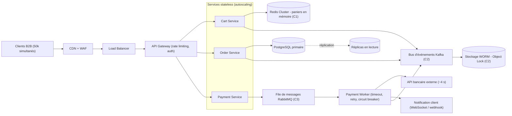

# Architecture — MegaShop-B2B

| Contrainte | Réponse |
|---|---|
| C1 — Panier < 50 ms et résilient | Redis Cluster répliqué, indépendant de PostgreSQL |
| C2 — Audit inaltérable | Événements Kafka archivés en stockage objet WORM |
| C3 — API bancaire lente | Traitement asynchrone via file de messages + notification |